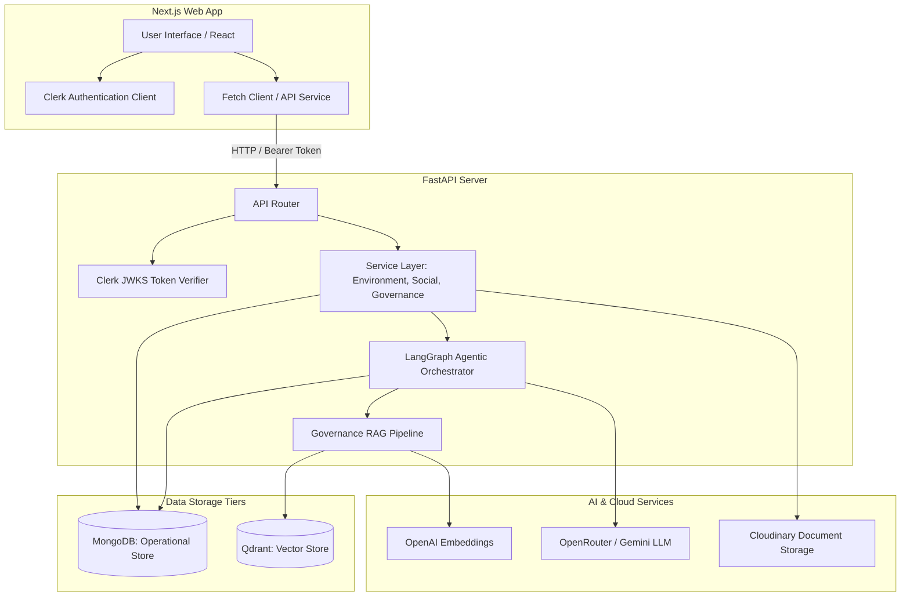
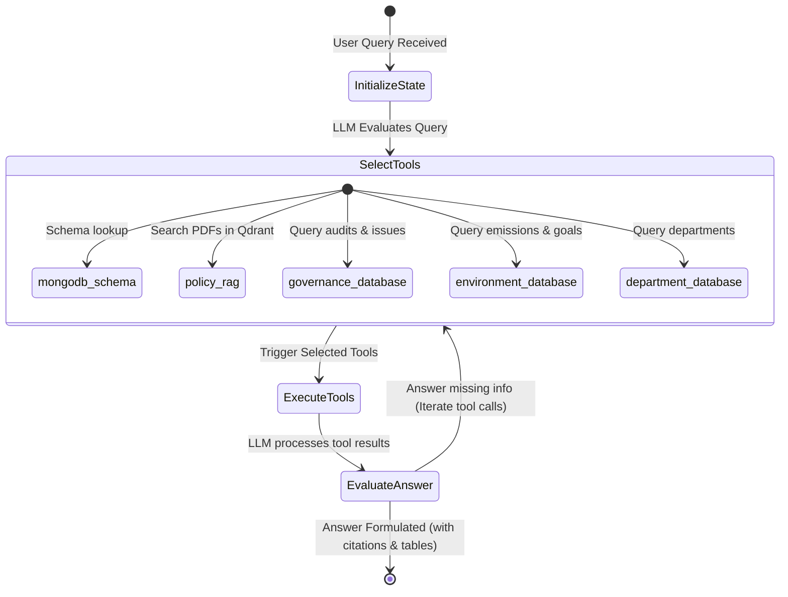

# EcoSphere: ESG Management Platform

EcoSphere is a modern, unified Enterprise ESG (Environmental, Social, and Governance) Management Platform. It integrates corporate operations, employee social participation, and governance compliance activities into a single interface while encouraging sustainability through gamification and providing intelligent Agentic AI / RAG policy tools.

---

## 🏗️ System Architecture

EcoSphere is built on a decoupled, three-tier architecture:
1. **Frontend**: React and Next.js (App Router) styled with Vanilla CSS/Tailwind, integrated with Clerk for secure, role-based authentication.
2. **Backend**: FastAPI (Python) serving REST APIs, integrated with PyJWT and Clerk JWKS validation.
3. **Databases**: MongoDB (Operational Data store via `motor` driver) and Qdrant (Vector Database for similarity search and RAG contexts).
4. **AI Core**: LangGraph for agentic workflow coordination, OpenAI for embeddings (`text-embedding-3-small`), and OpenRouter/Gemini for LLM reasoning.



---

## 🤖 Agentic AI & RAG Pipeline

EcoSphere features an intelligent governance assistant powered by **LangGraph** (agentic workflows) and **Qdrant** (Retrieval-Augmented Generation).

### 1. LangGraph Agent Workflow
When a user asks a complex governance or ESG question (e.g., *"What is our safety compliance risk and do we have safety audit findings?"*), the request is handled by a LangGraph **StateGraph** agent:



- **State Representation (`GovernanceAgentState`)**: Holds the database instances, user question, targeted policy IDs, active tools list, execution outputs, and citations list.
- **Available Tools**:
  - `mongodb_schema`: Provides JSON schemas of MongoDB collections.
  - `governance_database`: Queries policies, audits, compliance issues, and acknowledgements.
  - `environment_database`: Queries carbon emissions, factors, transactions, and goals.
  - `department_database`: Queries departments and ESG scores.
  - `policy_rag`: Searches embedded PDF policy documents using vector similarities.

### 2. The RAG Ingestion & Query Pipeline
1. **Document Upload**: Admin uploads a policy PDF (e.g., `Supplier Governance.pdf`).
2. **Chunking & Embedding**: The document is parsed using `PyMuPDF`, split into logical text chunks, and sent to OpenAI's `text-embedding-3-small` (1536 dimensions).
3. **Index Storing**: Chunks and vector embeddings are stored in a Qdrant collection (`governance_policy_chunks`) mapping back to the `esg_policies` MongoDB ID.
4. **Hybrid Querying**: When the copilot is queried, it generates matching embeddings, performs Qdrant cosine similarity matching, and passes the high-scoring document snippets as context to Gemini (`google/gemini-2.5-flash-lite`) via OpenRouter to formulate answers with direct page and snippet citations.

---

## 📁 Key Modules & Suggested Data Models

### 1. Environmental
- **Emission Factor**: Carbon intensities (e.g., Electricity = 0.82 kg/kWh).
- **Carbon Transaction**: Tracks operational activity quantities (kWh used, liters of diesel consumed) and auto-calculates emissions.
- **Environmental Goal**: Sustainability targets tracked by department per month/year.

### 2. Social
- **CSR Activity**: Community campaigns created by Admins (e.g., Tutoring, Beach Cleanups).
- **Employee Participation**: Submission logs showing text reflection, proof URL, and verification status (`pending`, `approved`, `rejected`).

### 3. Governance
- **ESG Policy**: Corporate policies and safety manuals chunked and indexed.
- **Policy Acknowledgement**: Auditable proof of employee acceptance.
- **Audit**: Scheduled compliance audits and audit scopes.
- **Compliance Issue**: Non-compliance incidents, with owner assignment, status, and target due date.

### 4. Gamification
- **XP & Points**: Earned by completing CSR events and compliance actions, stored directly on the user profile.
- **Leaderboard**: Real-time ranking of top 10 users by XP.
- **Badges**: Autolinked tags (e.g., `CSR Starter`, `Green Advocate`, `Climate Champion`).

---

## 🚀 Setup & Execution Guide

Ensure you have a running instance of **MongoDB** (`localhost:27017`) and setup your environment variables.

### 1. Backend Setup

Create a Python virtual environment, install dependencies, and run FastAPI:

```bash
cd backend
python3 -m venv .venv
source .venv/bin/activate
pip install -r requirements.txt

# Run the backend dev server (port 8000)
.venv/bin/uvicorn app.main:app --reload
```

### 2. Frontend Setup

Install npm dependencies and run the Next.js development server:

```bash
cd frontend
npm install

# Run the frontend dev server (port 3000)
npm run dev
```

### 3. Database Seeding

To populate operational data (departments, emissions, RAG policies) and gamification logs (leaderboard users, CSR activities, approved/pending/rejected participations):

```bash
cd backend
source .venv/bin/activate

# Seed environmental, user and governance data
PYTHONPATH=. .venv/bin/python app/scripts/seed_demo_data.py

# Seed social, gamification and leaderboard mock data
PYTHONPATH=. .venv/bin/python app/scripts/seed_social_data.py
```
